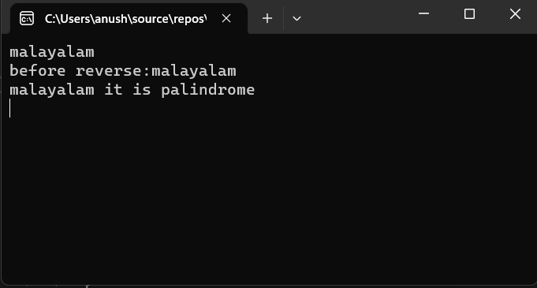

# Palindrome

## Aim:
To write a C# program to find whether the given string is a Palindrome or not.
## Algorithm:
1.Start the program.

2.Get the string value and read the string.

3.Use loop over the entire string and reverse it.

4.Use condional statement for checking the reversed string.

5.Print whether the string is palindrome or not a palindrome.

6.End the program.

## Program:
~~~
using System;
namespace exp2
{
    public class Palindrome
    {
        static void Main(string[] args)
        {
            string word, reverse = "";
            word = Convert.ToString(Console.ReadLine());
            Console.WriteLine("before reverse:" + word);
            for (int i = word.Length - 1; i >= 0; i--)
            {
                reverse += word[i];
            }
            if (reverse == word)
            {
                Console.WriteLine("{0} it is palindrome", reverse);
            }
            else
            {
                Console.WriteLine("{0} its not palindrome", reverse);
            }
            Console.ReadLine();
        }
    }
}
~~~

## Output:

## Result:
Thus the C# program to display whether the given string is Palindrome or not is executed successfully.
